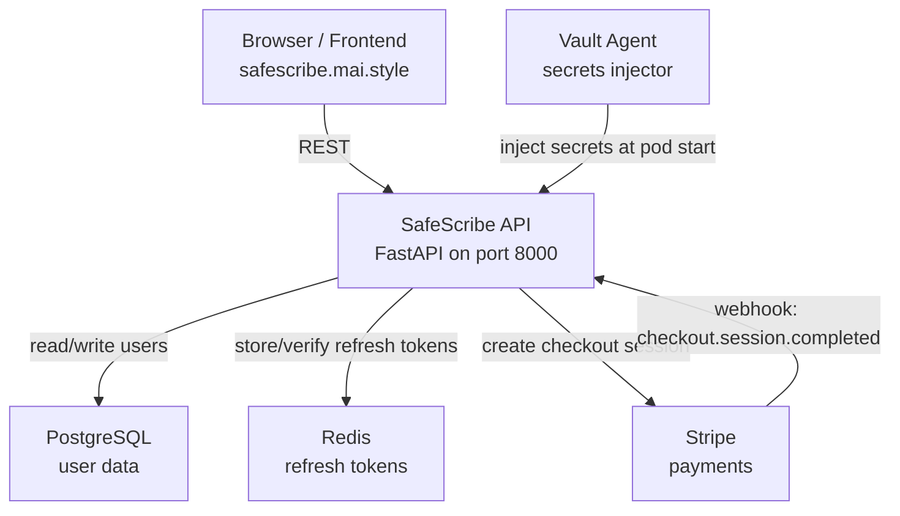
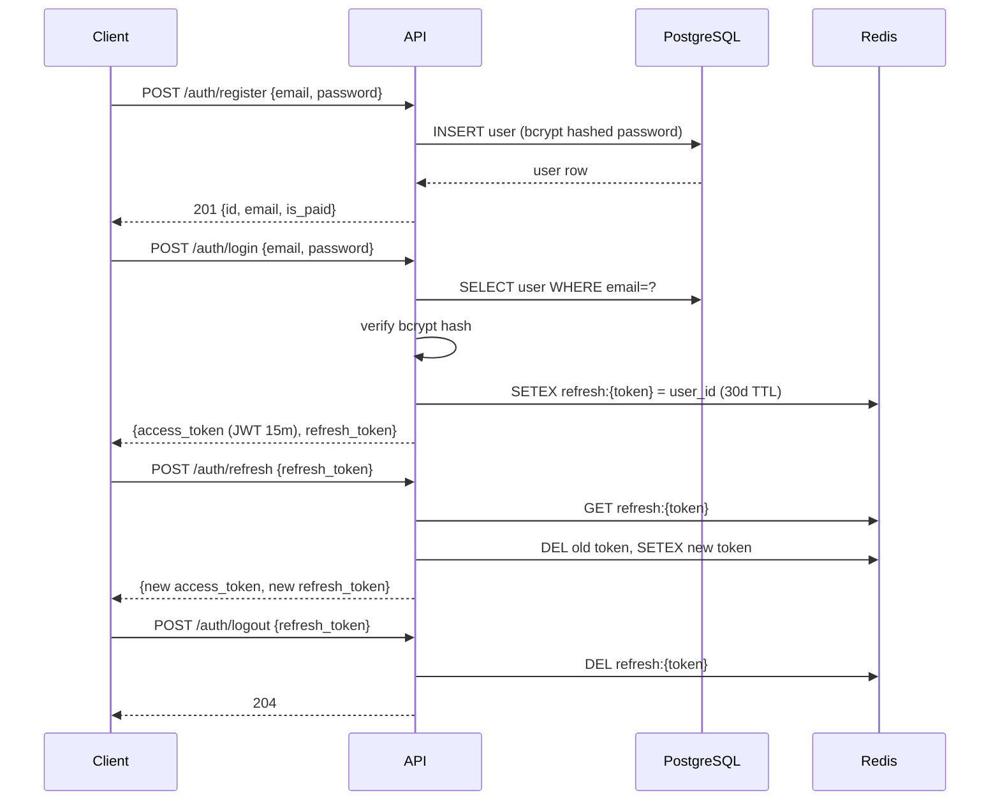
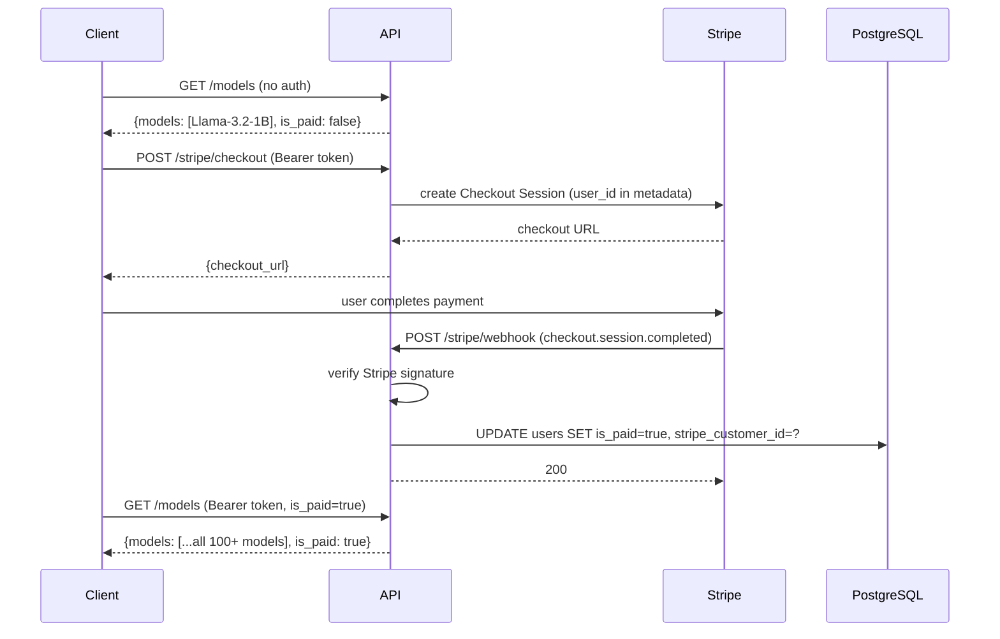
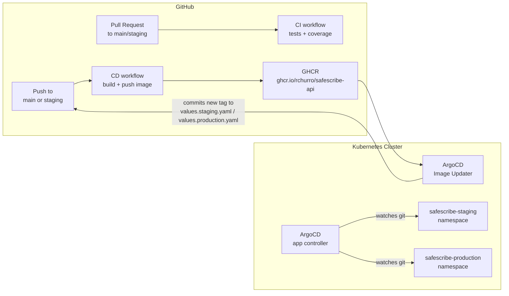
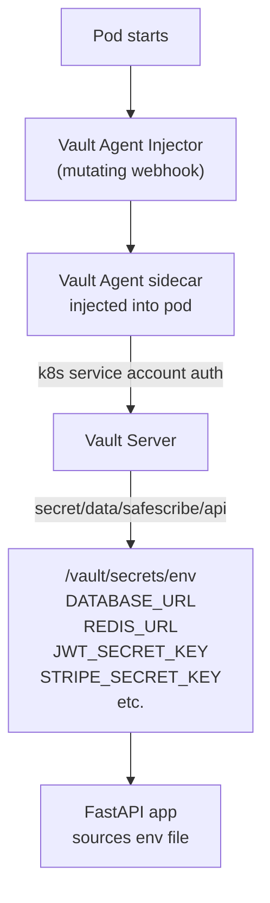

# safescribe-api

FastAPI paywall backend for SafeScribe. Handles user auth, Stripe subscriptions, and gating access to WebLLM model IDs based on subscription status.

## What it does

Users register and log in. Free users get access to one model (`Llama-3.2-1B`). Paid users unlock the full model list. Payment is handled by Stripe Checkout — when a subscription completes, a Stripe webhook flips `is_paid = true` on the user record.

## Architecture



## Request flows

### Auth



### Paywall



## CI/CD pipeline



**Tag format:**
- `staging` branch → `ghcr.io/rchurro/safescribe-api:staging-<sha>`
- `main` branch → `ghcr.io/rchurro/safescribe-api:main-<sha>`

## Secret management (Vault)

Secrets are never stored in git or Kubernetes secrets. At pod startup, the Vault Agent sidecar authenticates using the pod's Kubernetes service account, fetches secrets, and writes them to `/vault/secrets/env`. The app sources that file before starting.



Vault paths:
- Production: `secret/data/safescribe/api` (role: `safescribe-api`)
- Staging: `secret/data/safescribe/api-staging` (role: `safescribe-api-staging`)

## Infrastructure layout

Both environments run on the same Kubernetes cluster. Some infrastructure is shared, some is isolated:

| Component | Shared or isolated |
|---|---|
| PostgreSQL pod | **Shared** — separate databases (`safescribe` vs `safescribe_staging`) |
| Redis pod | **Shared** — separate DB indexes (`/0` vs `/1`) |
| Vault pod | **Shared** — separate secret paths and auth roles per env |
| ArgoCD | **Shared** — manages both apps |
| App pods | **Isolated** — separate namespaces, deployments, service accounts |
| Cloudflare Tunnel | **Isolated** — separate tunnel and `cloudflared` deployment per environment |
| Stripe keys | **Isolated** — live keys for production, test keys for staging |
| JWT secrets | **Isolated** — separate keys per environment |

If Postgres or Redis goes down, both environments are affected. This is an intentional tradeoff to keep infrastructure costs low.

## Helm environments

| Values file | Namespace | Image tag pattern | Replicas | Autoscaling |
|---|---|---|---|---|
| `values.yaml` | — | base defaults | 2 | off |
| `values.staging.yaml` | `safescribe-staging` | `staging-<sha>` | 1 | off |
| `values.production.yaml` | `safescribe-production` | `main-<sha>` | 2 | 2–6 pods |

## Development workflow

Changes go through a PR process — direct pushes to `main` or `staging` are discouraged.

```
feature branch → pull request → CI → merge → CD → deploy
```

**CI** runs automatically on every PR to `main` or `staging`:
- Spins up real Postgres 16 and Redis 7 containers (no mocks)
- Runs the full test suite with coverage
- Must pass before merging

**CD** runs automatically on every push to `main` or `staging`:
- Builds a multi-arch Docker image (`linux/amd64`, `linux/arm64`)
- Pushes to GHCR with a `<branch>-<sha>` tag
- ArgoCD Image Updater detects the new tag and triggers a rolling deploy

| Branch | Environment | Image tag |
|---|---|---|
| `staging` | `safescribe-staging` | `staging-<sha>` |
| `main` | `safescribe-production` | `main-<sha>` |

## Local development

```bash
cp .env.example .env
# fill in .env

docker compose up          # starts api + postgres + redis
docker compose run migrate # run on first setup or after new migration
```

API available at `http://localhost:8000`.  
Swagger UI at `http://localhost:8000/docs` (only when `DEBUG=true`).

## Database migrations

```bash
# create a new migration
alembic revision --autogenerate -m "description"

# apply
alembic upgrade head

# rollback one
alembic downgrade -1
```

Migrations run automatically at app startup (before uvicorn starts) on every deploy.

## API endpoints

| Method | Path | Auth | Description |
|---|---|---|---|
| `POST` | `/auth/register` | none | Create account |
| `POST` | `/auth/login` | none | Get access + refresh tokens |
| `POST` | `/auth/refresh` | none | Rotate tokens |
| `POST` | `/auth/logout` | Bearer | Invalidate refresh token |
| `GET` | `/models` | optional | List available WebLLM model IDs |
| `POST` | `/stripe/checkout` | Bearer | Create Stripe Checkout session |
| `POST` | `/stripe/webhook` | Stripe sig | Handle payment events |
| `GET` | `/health` | none | Liveness check |
| `GET` | `/metrics` | none | Prometheus metrics |

## Notifications

Discord notifications are sent to a private channel on:

| Event | Source |
|---|---|
| Image build success/fail | GitHub Actions (CD workflow) |
| Test pass/fail | GitHub Actions (CI workflow) |
| Deploy succeeded | ArgoCD Notifications |
| Health degraded | ArgoCD Notifications |
| Sync failed | ArgoCD Notifications |

Requires a `DISCORD_WEBHOOK` secret set in GitHub repository secrets (Settings → Secrets and variables → Actions).
